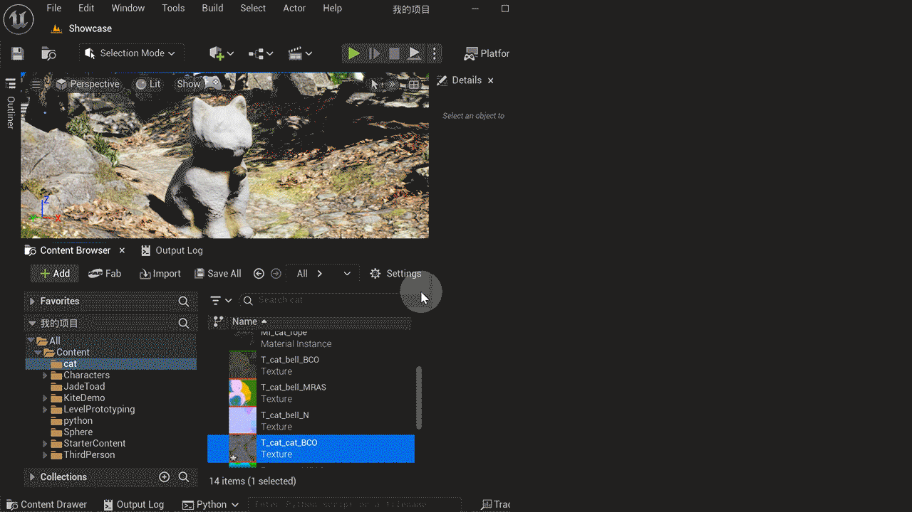

# UE Texture Editor Tool (UE贴图编辑工具)

一个用于虚幻引擎的贴图编辑工具，提供与Photoshop的实时同步编辑功能。
</br>

## 功能特点

- 在虚幻引擎内直接打开Photoshop编辑贴图
- 实时监控贴图变化并自动重新导入
- 保持贴图设置（如sRGB、压缩设置、LOD组等）
- 支持自定义Photoshop安装路径
- 支持多贴图同时编辑
- 自动清理临时文件

## 安装要求

- 虚幻引擎 4.26或更高版本
- Adobe Photoshop
- Python 3.7+

## 安装步骤

1. 将项目文件复制到虚幻引擎的Python脚本目录：
   ```
   a. {项目目录}/Content/Python/

   b. C:/Users/{Username}/Documents/UnrealEngine/Python
   ```

2. 确保以下文件已正确放置：
   - `init_unreal.py`
   - `send_tools.py`

## 配置说明

在`send_tools.py`中，你可以配置Photoshop的安装路径：
- 如果需要指定自定义Photoshop安装路径，请修改`PHOTOSHOP_CUSTOM_PATH`
- 如果使用默认安装路径，保持配置为空即可

## 使用方法

1. 在内容浏览器中选择要编辑的贴图
2. 右键点击选中的贴图
3. 在右键菜单中选择 "Send" -> "Send to Photoshop"
4. Photoshop将自动打开选中的贴图
5. 编辑完成后保存，贴图将自动在虚幻引擎中更新

## 功能说明

### 自动同步
- 工具会自动监控Photoshop中编辑的贴图文件
- 当检测到文件变化时，自动重新导入到虚幻引擎
- 保持原有的贴图设置不变

### 多文件支持
- 支持同时选择多个贴图进行编辑
- 每个贴图都会被独立监控和同步

### 自动清理
- 当Photoshop关闭时，自动清理临时文件
- 自动停止相关的监控进程

## 注意事项

1. 确保有足够的磁盘空间用于临时文件
2. 编辑时请不要手动删除临时文件
3. 如果找不到Photoshop，请检查安装路径或配置自定义路径

## 错误处理

如果遇到以下情况，工具会显示相应的错误提示：
- 未选择贴图资产
- 找不到Photoshop安装路径
- 贴图导出失败

## 开发者信息

如需修改或扩展功能，主要的类和文件说明：

- `PhotoshopBridge`: 处理与Photoshop的交互
- `TextureMonitor`: 监控贴图文件变化
- `MenuInitializer`: 初始化编辑器菜单
