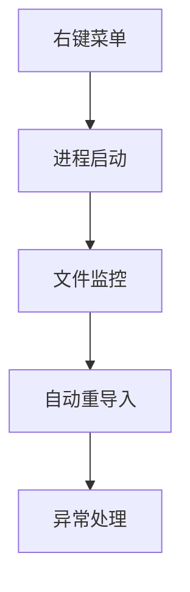
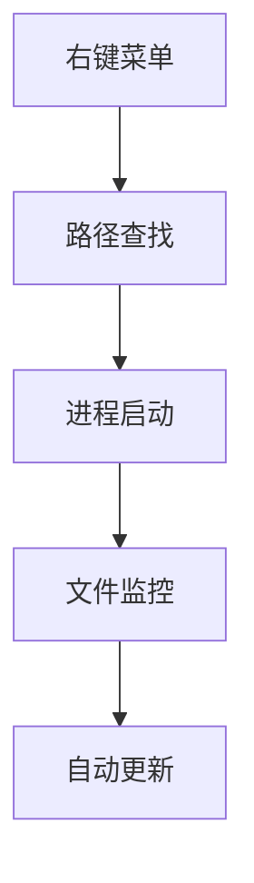

# UE Texture Send Photoshop Tool (UE贴图同步PS工具)


</br>
## B站视频教程

[Unreal Python 工具开发基础教程](https://www.bilibili.com/video/BV1peALe2Eqz)
## 一、获取与部署

**GitHub项目地址**: [yangskin/UESendTo](https://github.com/yangskin/UESendTo)

UE Texture Editor Tool 提供与 Photoshop 的实时同步编辑功能，适用于 Unreal Engine 5.1 或更高版本。

### 获取方式

1. 从 GitHub 仓库 [yangskin/UESendTo](https://github.com/yangskin/UESendTo) 下载或克隆项目。
2. 将项目文件复制到虚幻引擎的 Python 脚本目录：
   - `{项目目录}/Content/Python/`
   - 或 `C:/Users/{Username}/Documents/UnrealEngine/Python`

### 部署方式

1. 确保安装了 Python 3.7+ 并在 Unreal Engine 中启用了 Python 插件。
2. 确保安装了 Adobe Photoshop。
3. 打开项目后，检查以下文件是否已正确放置：
   - `init_unreal.py`
   - `send_tools.py`
4. 在 `send_tools.py` 中根据需要配置自定义 Photoshop 安装路径：
   - `PHOTOSHOP_CUSTOM_PATH`: 自定义安装路径
   - `PHOTOSHOP_DEFAULT_PATH`: 保持为空时工具会尝试查找默认安装

### 使用方法（简要）

1. 在 Unreal Editor 的内容浏览器中选择需要编辑的贴图。
2. 右键点击选中的贴图，在右键菜单中找到 `Send -> Send to Photoshop`。
3. Photoshop 会自动打开对应的贴图文件，编辑后保存。
4. 工具会自动检测文件变化并重新导入贴图，保持原有贴图设置。

**主要功能**

- 实时同步编辑：自动监控贴图变化并更新 Unreal 资源
- 多贴图支持：可同时编辑多个贴图
- 自动清理：关闭 Photoshop 时清理临时文件
- 配置可扩展：可在代码中修改自定义路径

---

## 二、为什么美术需要自动化工具？

在游戏开发中，美术人员常面临重复性操作：

1. 频繁在Unreal与Photoshop之间切换
2. 手动导出/导入贴图资源
3. 需要实时查看修改效果
4. 管理多个外部软件进程

传统工作流程存在效率瓶颈，这正是我们开发自动化工具的价值所在。

---

## 二、需求分析与技术调研

### 1. 核心需求分解

- **右键菜单扩展**：在资源浏览器添加操作入口
- **跨程序通信**：启动并控制Photoshop进程
- **文件监控**：实时检测贴图修改
- **自动重导入**：修改后更新引擎资源

### 2. Unreal Python API重点

- **菜单系统**：`unreal.ToolMenus`
- **定时器**：`register_slate_post_tick_callback`
- **资产操作**：`AssetTools` 相关接口
- **进程管理**：`subprocess` 模块

### 3. 技术方案选型



---

## 三、API测试：安全探索的路线图

### 1. 什么是API？

API就像编程世界的工具手册，告诉我们可以使用哪些预制功能。例如：

- **菜单API**：创建按钮和菜单
- **文件API**：读取/监控文件
- **进程API**：启动外部软件

### 2. 测试策略四步走


### 实际案例：

1. 在Python控制台输入：
   ```python
   import unreal
   unreal.log("Hello Artist!")
   ```
2. 测试文件监控：
   ```python
   import os
   print(os.path.getmtime("test.psd")) # 输出时间戳
   ```
3. 调试技巧可视化
   - **日志追踪**：在关键位置插入 `unreal.log()`
   - **渐进测试**：先验证单个功能再组合
   - **错误防护**：
     ```python
     try:
        启动Photoshop()
     except 找不到软件:
        显示错误提示()
     ```

### 4. 使用 Unreal Engine Output Log 调试 Python

对于初次接触 Unreal Python 的同学，借助 **Output Log**（日志窗口）可以快速尝试脚本：

1. 在 Unreal Editor 顶部菜单中，依次选择 **Window -> Developer Tools -> Output Log**。
2. 在下方窗口中切换到 **Python** 选项卡。
3. 直接输入 Python 语句并回车，如：
   ```python
   import unreal
   unreal.log("Using Output Log to debug!")
   ```
4. 在右侧或下方面板中查看输出与调试信息，当脚本出现错误时会在此处提示。
5. 若想监控代码执行，可在关键逻辑处增加 `unreal.log()`，并在 Output Log 中观察运行过程。

---

## 四、开发实战：积木式搭建系统

### 1. 整体架构设计



### 2. 核心模块解析

#### 模块1：智能路径查找

```python
def 找PS安装路径():
   先查用户自定义路径 → 找不到就找默认位置 → 都找不到就报错
```

**设计要点：**

- 优先尊重用户配置
- 提供明确错误指引
- 兼容不同系统版本

#### 模块2：安全启动器

```python
def 启动PS(路径列表):
   # 像指挥官一样：
   1. 组装启动命令
   2. 开启新进程
   3. 给每个贴图配个"警卫"（监控器）
```

**类比理解：**

- `subprocess` ≈ 启动新程序的遥控器
- `Popen` = 程序启动按钮

#### 模块3：忠诚的监控员

```python
class 文件监控员:
   持续检查文件"最后修改时间"
   发现变化 → 触发引擎更新
```

**工作机制：**

- 每秒钟检查一次（可调节）
- 类似定期巡逻的保安
- 发现异常立即报告

### 3. 用户体验增强设计

#### 错误处理设计

```python
if 找不到PS路径:
   弹出友好提示框 ← 比命令行错误更易懂
   建议解决方案 ← 引导用户检查安装
```

#### 进程管理设计

- 保持PS进程句柄 → 可随时关闭
- 监控器绑定进程 → PS关闭时停止监控

### 4. 工具核心代码解析

在这里，我们通过节选的关键代码，演示如何实现贴图导出、启动Photoshop并监控文件变化的功能。完整的逻辑主要包含以下几部分：

1. **TickTimer** 管理引擎的`tick`事件，用于定时执行检查：

```python
class TickTimer:
    """定时器基类，用于处理虚幻引擎的 tick 事件。"""

    def __init__(self, interval: float = 1.0):
        self._tick = unreal.register_slate_post_tick_callback(self._timer)
        self.interval = interval
        self._current_interval = 0.0

    def _timer(self, delta: float) -> None:
        # 按固定间隔执行逻辑
        self._current_interval += delta
        if self._current_interval < self.interval:
            return
        self._current_interval = 0.0
        # ... 其他实现

    def stop(self) -> None:
        # 停止 tick 回调
        if self._tick:
            unreal.unregister_slate_post_tick_callback(self._tick)
```

2. **TextureMonitor** 继承 TickTimer，用于监控文件修改：

```python
class TextureMonitor(TickTimer):
    """监控贴图文件变化并自动重新导入"""

    def __init__(self, texture_path, asset_path, callback, process):
        # 初始化并记录文件最后修改时间
        super().__init__(1.0)
        self.texture_path = texture_path
        self.asset_path = asset_path
        self.callback = callback
        self.process = process
        self.last_modified = os.path.getmtime(texture_path)

    def _timer(self, delta: float) -> None:
        # 定时检查文件变化
        super()._timer(delta)
        # ... 其他实现

    def _reimport_texture(self) -> None:
        """重新导入贴图的核心逻辑"""
        # ... 通过 EditorAssetLibrary.load_asset 读取资产
        # ... 储存原有设置并执行导入
        # ... 恢复贴图设置
```

3. **PhotoshopBridge** 用于和 Photoshop 进行交互：

```python
class PhotoshopBridge(IMonitorCallback):
    """处理与 Photoshop 的交互。"""

    def open_selected(self) -> None:
        ps_path = self._find_photoshop()
        if ps_path:
            export_path = self._export_texture()
            if export_path:
                self._launch_photoshop(ps_path, export_path)

    def _launch_photoshop(self, ps_path, texture_path_list):
        # 启动 Photoshop 进程
        command = [ps_path] + [p[0] for p in texture_path_list]
        process = subprocess.Popen(command)
        # 给每个贴图注册监控器
        for path, asset in texture_path_list:
            self.texture_monitors.append(
                TextureMonitor(path, asset, self, process)
            )

    # ... 省略其他辅助方法
```

在以上核心片段中：

- **TickTimer** 负责定时触发，**TextureMonitor** 检测本地文件变化并自动触发重新导入逻辑。
- **PhotoshopBridge** 封装了进程启动和资源监控器注册，使得 Photoshop 编辑和 Unreal 导入之间顺畅衔接。

通过这些关键代码，可以直观了解如何让贴图在 Photoshop 中修改后，自动刷新回 Unreal Engine，实现跨程序的实时编辑。具体实现如查找 Photoshop 安装路径、导出贴图、以及错误提示等逻辑，可根据需求扩展或裁剪。

---

## 五、关键技术通俗解读

### 1. 重要概念解释

| 技术名词         | 美术友好解释       | 现实类比  |
| ------------ | ------------ | ----- |
| `subprocess` | 程序启动遥控器      | 电器遥控板 |
| 回调函数         | 事件触发自动执行的任务  | 自动感应门 |
| 进程句柄         | 程序操作的"遥控器"   | 汽车钥匙  |
| 时间戳          | 文件的"最后修改身份证" | 文件版本号 |

### 2. 设计模式解析

- **观察者模式**：文件监控员持续观察贴图状态
- **工厂模式**：统一创建监控器实例
- **回调机制**：各模块间的消息传递系统

---

## 六、给非程序员的建议

### 1. 思维转换技巧

- 将代码逻辑想象为流水线工序
- 用流程图替代代码理解
- 重点关注输入/输出转换

### 2. 安全开发原则

1. **新功能先在测试环境验证**
2. **重要操作添加确认提示**
3. **保留操作日志方便追溯**

### 3. 协作开发策略


---

## 七、扩展方向

1. **支持多软件**（Substance Painter等）
2. **添加版本控制集成**
3. **开发批量处理功能**
4. **创建可视化配置面板**

